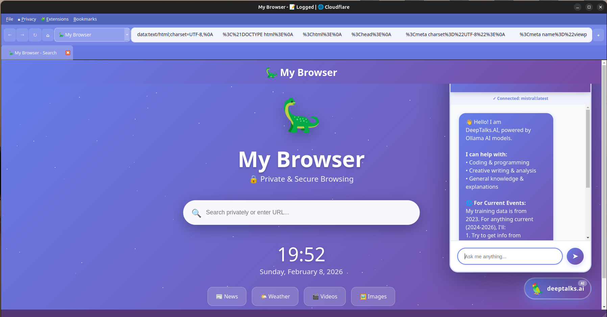
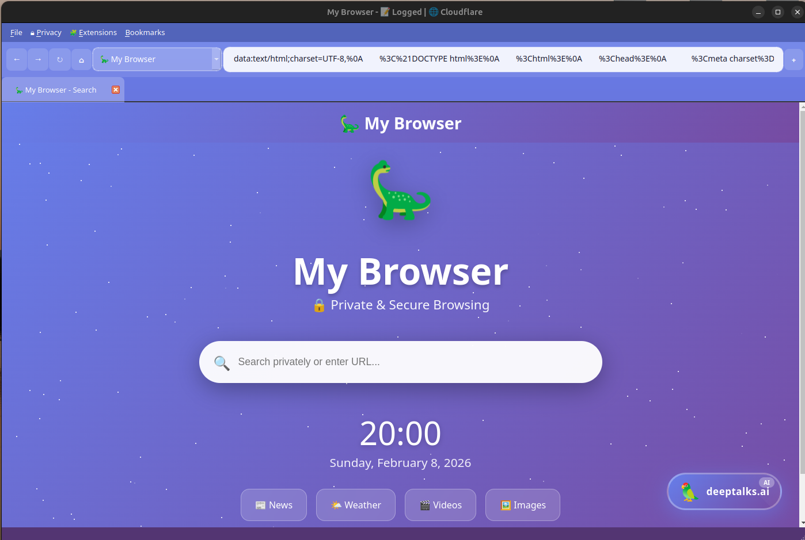
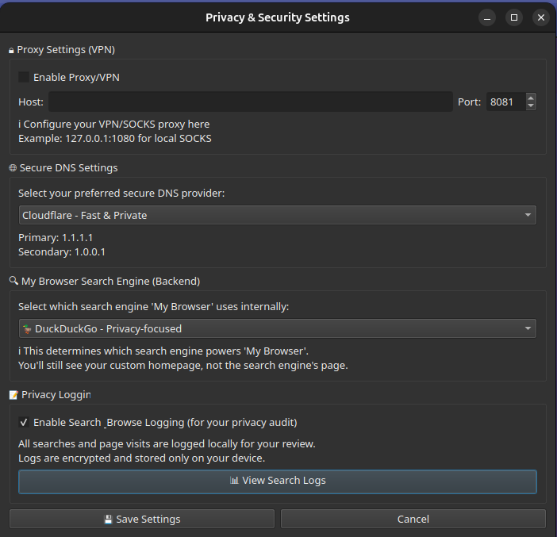

# 🦕 My Browser - Privacy Edition

<div align="center">



**A Modern, Privacy-Focused Web Browser with Integrated AI Chatbot**

[](https://python.org)
[](https://www.riverbankcomputing.com/software/pyqt/)
[](LICENSE)
[]()

[Features](#-features) • [Installation](#-installation) • [Usage](#-usage) • [Screenshots](#-screenshots) • [FAQ](#-faq)

</div>

---

## ✨ Features

### 🔒 **Privacy & Security**
- 🛡️ **Privacy Logging**: All browsing tracked locally for your audit
- 🌐 **Secure DNS**: Choose Cloudflare, Google, Quad9, or OpenDNS
- 🔐 **Proxy Support**: Configure HTTP/SOCKS proxies for enhanced privacy
- 🚫 **Ad Blocker**: Built-in ad blocking extension
- 📝 **Search Logging**: Keep track of all your searches (stored locally only)
- 🗑️ **Clear Data**: One-click clearing of history, cache, and cookies

### 🤖 **AI Chatbot - DeepTalks.AI** 🦜
- 💬 **Natural Conversations**: Chat with AI powered by Ollama
- 💻 **Code Generation**: Get properly formatted code with syntax highlighting
- 🌐 **Web Search Integration**: Auto-searches web for current events
- 📋 **Copy Buttons**: Easy copy for both text and code blocks
- 🐧 **Linux Compatible**: Clipboard works perfectly on all platforms
- ⚡ **Fast & Local**: All processing happens on your machine

### 🔍 **Multiple Search Engines**
- 🦕 **My Browser**: Custom search experience with configurable backend
- 🔍 **Google**: Comprehensive search results
- 🦁 **Brave**: Private, ad-free searching
- 🦆 **DuckDuckGo**: Privacy-focused search engine

### 🌐 **Browser Features**
- 📑 **Multi-Tab Browsing**: Unlimited tabs with smooth management
- ⭐ **Bookmarks**: Save and organize your favorite sites
- 📥 **Download Manager**: Integrated download handling
- 🧩 **Extensions**: Custom JavaScript extension system
- 🎨 **Beautiful UI**: Gradient design with smooth animations
- ⏰ **Real-Time Clock**: Always know the time and date

---

## 📋 Requirements

### System Requirements

| Component | Minimum | Recommended |
|-----------|---------|-------------|
| **Python** | 3.8+ | 3.10 or 3.11 |
| **RAM** | 2 GB | 4 GB+ |
| **Storage** | 500 MB | 1 GB+ |
| **OS** | Windows 10, Ubuntu 20.04, macOS 10.14 | Windows 11, Ubuntu 22.04, macOS 12+ |

### Required Software

#### Python Dependencies
```
PyQt6==6.7.0
PyQt6-WebEngine==6.7.0
Flask==3.0.0
Flask-CORS==4.0.0
requests==2.31.0
```

#### Optional (For AI Features)
- **Ollama**: Local AI model runtime
  - Download: [https://ollama.ai](https://ollama.ai)
  - Models: Mistral, Llama 3, CodeLlama, etc.

---

## 🚀 Installation

### 🪟 Windows Installation

<details>
<summary><b>Click to expand Windows installation guide</b></summary>

#### Step 1: Install Python

1. **Download Python** (if not installed)
   - Visit: [https://www.python.org/downloads/](https://www.python.org/downloads/)
   - Download Python 3.11 (recommended) or 3.10+
   - **IMPORTANT**: During installation, check ✅ **"Add Python to PATH"**

2. **Verify Installation**
   ```cmd
   python --version
   pip --version
   ```

#### Step 2: Download My Browser

**Option A: Download ZIP**
1. Click the green **"Code"** button on GitHub
2. Select **"Download ZIP"**
3. Extract to `C:\Users\YourName\Documents\my-browser`

**Option B: Git Clone**
```cmd
git clone https://github.com/deeptanshb/My_Browser.git
cd My_Browser
```

#### Step 3: Run Installer

```cmd
cd My_Browser
install.bat
```

The installer will:
- ✅ Check Python installation
- ✅ Install all dependencies
- ✅ Check for Ollama
- ✅ Create desktop shortcut
- ✅ Set up browser data directory

#### Step 4: Install Ollama (Optional - For AI Chatbot)

1. **Download Ollama**
   - Visit: [https://ollama.ai/download](https://ollama.ai/download)
   - Download Windows installer
   - Run installer (follow prompts)

2. **Pull AI Model**
   ```cmd
   ollama pull mistral
   ```
   
   Other models you can try:
   ```cmd
   ollama pull llama3
   ollama pull codellama
   ollama pull phi
   ```

3. **Verify Ollama**
   ```cmd
   ollama list
   ```

#### Step 5: Launch Browser

**Option A: Desktop Shortcut**
- Double-click **"My Browser"** on your desktop

**Option B: Start Menu**
- Search for **"My Browser"** in Start Menu

**Option C: Command Line**
```cmd
cd My_Browser
python launch_mybrowser.py
```

#### Troubleshooting Windows

**Issue: "Python is not recognized"**
```cmd
# Add Python to PATH manually
# Windows Key + X → System → Advanced → Environment Variables
# Add: C:\Users\YourName\AppData\Local\Programs\Python\Python311
```

**Issue: pip install fails**
```cmd
python -m pip install --upgrade pip
python -m pip install -r requirements.txt
```

**Issue: Ollama not working**
```cmd
# Check if Ollama is running
ollama serve

# In another terminal
ollama pull mistral
```

**Issue: Browser won't start**
```cmd
# Reinstall dependencies
pip uninstall PyQt6 PyQt6-WebEngine
pip install PyQt6==6.7.0 PyQt6-WebEngine==6.7.0
```

</details>

---

### 🐧 Linux Installation (Ubuntu/Debian)

<details>
<summary><b>Click to expand Linux installation guide</b></summary>

#### Step 1: Install System Dependencies

```bash
# Update package list
sudo apt update

# Install Python and pip
sudo apt install python3 python3-pip python3-venv

# Install PyQt6 dependencies
sudo apt install python3-pyqt6 python3-pyqt6.qtwebengine

# Install additional libraries
sudo apt install qt6-base-dev libqt6webengine6 libqt6webenginecore6
```

#### Step 2: Clone Repository

```bash
# Clone from GitHub
git clone https://github.com/deeptanshb/My_Browser.git
cd My_Browser

# Or download and extract ZIP
wget https://github.com/deeptanshb/My_Browser/archive/main.zip
unzip main.zip
cd My_Browser-main
```

#### Step 3: Run Installer

```bash
# Make installer executable
chmod +x install.sh

# Run installer
./install.sh
```

The installer will:
- ✅ Create virtual environment
- ✅ Install Python dependencies
- ✅ Check for Ollama
- ✅ Create desktop launcher
- ✅ Set up browser data directory

#### Step 4: Install Ollama (Optional - For AI Chatbot)

```bash
# Download and install Ollama
curl -fsSL https://ollama.ai/install.sh | sh

# Or manual download
wget https://ollama.ai/download/linux
sudo install -m 755 ollama /usr/local/bin/ollama

# Pull AI model
ollama pull mistral

# Try other models
ollama pull llama3
ollama pull codellama
```

#### Step 5: Launch Browser

**Option A: Applications Menu**
- Open Applications → Internet → My Browser

**Option B: Desktop Launcher**
- Double-click "My Browser" on desktop

**Option C: Command Line**
```bash
cd My_Browser
python3 launch_mybrowser.py
```

#### Troubleshooting Linux

**Issue: PyQt6 installation fails**
```bash
# Try with --break-system-packages
pip3 install PyQt6 PyQt6-WebEngine --break-system-packages

# Or use virtual environment
python3 -m venv venv
source venv/bin/activate
pip install -r requirements.txt
```

**Issue: Permission denied**
```bash
chmod +x launch_mybrowser.py
chmod +x install.sh
```

**Issue: Ollama not found**
```bash
# Check if Ollama is running
systemctl status ollama

# Start Ollama
ollama serve &

# Or start as service
sudo systemctl enable ollama
sudo systemctl start ollama
```

**Issue: Browser data directory**
```bash
# Create manually if needed
mkdir -p ~/.mybrowser
chmod 755 ~/.mybrowser
```

</details>

---

### 🍎 macOS Installation

<details>
<summary><b>Click to expand macOS installation guide</b></summary>

#### Step 1: Install Homebrew (if needed)

```bash
/bin/bash -c "$(curl -fsSL https://raw.githubusercontent.com/Homebrew/install/HEAD/install.sh)"
```

#### Step 2: Install Python

```bash
brew install python@3.11
```

#### Step 3: Clone Repository

```bash
git clone https://github.com/deeptanshb/My_Browser.git
cd My_Browser
```

#### Step 4: Install Dependencies

```bash
# Create virtual environment
python3 -m venv venv
source venv/bin/activate

# Install requirements
pip install -r requirements.txt
```

#### Step 5: Install Ollama (Optional)

```bash
# Download and install Ollama
curl -fsSL https://ollama.ai/install.sh | sh

# Pull AI model
ollama pull mistral
```

#### Step 6: Launch Browser

```bash
python3 launch_mybrowser.py
```

</details>

---

## 📖 Usage Guide

### 🎯 Quick Start

1. **Launch the browser** using one of the installation methods above
2. **Home page** appears with search bar and quick links
3. **Search or enter URL** in the search bar
4. **Click AI button** (🦜 deeptalks.ai) in bottom-right corner for chatbot

### 🤖 Using the AI Chatbot

1. **Open Chatbot**
   - Click the **deeptalks.ai** button (bottom-right)
   - The chatbot panel slides in from the right

2. **Ask Questions**
   - Type your question in the input box
   - Press **Enter** or click the **➤** button
   - AI responds with formatted text

3. **Copy Responses**
   - **📋 Button** in top-right of message: Copy entire response
   - **📋 Button** on code block: Copy only the code
   - Works perfectly on Linux!

4. **Web Search**
   - Ask about current events: "What's the latest AI news?"
   - AI automatically searches and provides up-to-date info
   - Keywords like "latest", "current", "today" trigger web search

### 📚 Example Conversations

```
You: Write a Python hello world program
AI: [Provides formatted code with copy button]

You: What's the weather today?
AI: [Searches web and provides current weather]

You: Explain quantum computing
AI: [Provides detailed explanation with examples]
```

### 🔍 Search Engines

**Change Search Engine:**
1. Go to **Privacy** → **Privacy Settings**
2. Select **Backend Search Engine**
3. Choose: Brave, Google, DuckDuckGo, Bing, etc.
4. Click **Save Settings**

### ⭐ Bookmarks

- **Add Bookmark**: Press **Ctrl+D** or go to Bookmarks → Add Bookmark
- **View Bookmarks**: Bookmarks → Show Bookmarks
- **Open Bookmark**: Double-click to open

### 📜 Privacy Logs

**View Your Browsing History:**
1. Go to **Privacy** → **Privacy Settings**
2. Click **View Logs** button
3. See all your searches and page visits
4. Export or clear logs as needed

### 🧩 Extensions

**Manage Extensions:**
1. Go to **Extensions** → **Manage Extensions**
2. **Enable/Disable** extensions with toggle switches
3. **Add Extension**: Click "Add Extension" and select .js file
4. **Remove Extension**: Select and click "Remove Extension"

**Built-in Extensions:**
- ✅ **Ad Blocker**: Block advertisements (enabled by default)
- 🌙 **Dark Mode**: Force dark mode on all websites
- 🛡️ **Privacy Shield**: Block trackers and fingerprinting
- ⬇️ **Auto Scroll**: Smooth scrolling with arrow keys

---

## 📁 Project Structure

```
My_Browser/
├── 📄 custom.py                 # Main browser application (2300+ lines)
├── 🚀 launch_mybrowser.py       # Enhanced launcher with CORS proxy
├── 🔧 ollama_cors_proxy.py      # CORS proxy for Ollama API
├── 🪟 install.bat               # Windows installer
├── 🐧 install.sh                # Linux/macOS installer
├── 📋 requirements.txt          # Python dependencies
├── 📖 README.md                 # This file
├── 📜 LICENSE                   # MIT License
├── 🙈 .gitignore               # Git ignore rules
│
├── 📂 screenshots/              # Screenshot images
│   ├── screenshot.png           # Main browser screenshot
│   ├── screenshot_browser.png   # Home screen
│   ├── screenshot_chatbot.png   # AI chatbot interface
│   └── screenshot_logs.png      # Privacy logs & settings 
│
└── 📂 ~/.mybrowser/             # User data directory (auto-created)
    ├── ⚙️ settings.json         # Browser settings
    ├── ⭐ bookmarks.json        # Saved bookmarks
    ├── 📜 history.json          # Browsing history
    ├── 🔍 search_log.txt        # Search queries log
    ├── 🔒 privacy_log.json      # Privacy audit log
    └── 📂 extensions/           # Custom extensions directory
        ├── ad_blocker.js
        ├── dark_mode.js
        └── privacy_shield.js
```

---

## 📷 Screenshots

<div align="center">

### Home Screen


*Beautiful gradient homepage with search bar and quick links*

### AI Chatbot


*DeepTalks.AI chatbot with code formatting and copy buttons*

### Privacy Logs


*View all your browsing history and searches*

</div>

---

## 🔧 Configuration

### Browser Settings

All settings are stored in `~/.mybrowser/settings.json`:

```json
{
  "browser": "My Browser",
  "backend_search_engine": "Brave Search",
  "dns_provider": "Cloudflare",
  "proxy_enabled": false,
  "proxy_host": "",
  "proxy_port": 0,
  "privacy_logging": true
}
```

### Changing Search Engine

**Via UI:**
Privacy → Privacy Settings → Backend Search Engine

**Via File:**
Edit `~/.mybrowser/settings.json`

### DNS Configuration

**Available Providers:**
- 🌐 **Cloudflare**: 1.1.1.1 (Fast & Private)
- 🔍 **Google**: 8.8.8.8 (Reliable & Fast)
- 🛡️ **Quad9**: 9.9.9.9 (Security Focused)
- 👨‍👩‍👧‍👦 **OpenDNS**: 208.67.222.222 (Family Safe)

**Note**: DNS settings shown are informational. Actual DNS changes require system-level configuration.

---

## 🐛 Troubleshooting

### Common Issues

<details>
<summary><b>Browser won't start</b></summary>

**Check Python version:**
```bash
python --version  # Must be 3.8+
```

**Reinstall dependencies:**
```bash
pip install --upgrade -r requirements.txt
```

**Check for errors:**
```bash
python launch_mybrowser.py
# Look for error messages
```

</details>

<details>
<summary><b>AI Chatbot not working</b></summary>

**Cause**: Ollama not installed or not running

**Solution**:
```bash
# Check if Ollama is installed
ollama --version

# If not installed
# Windows: Download from https://ollama.ai/download
# Linux: curl -fsSL https://ollama.ai/install.sh | sh

# Start Ollama
ollama serve

# Pull a model
ollama pull mistral

# Restart browser
```

</details>

<details>
<summary><b>Chatbot shows "toggleChatbot is not defined"</b></summary>

**Cause**: Old version of custom.py

**Solution**: Download the latest `custom.py` from GitHub

</details>

<details>
<summary><b>Copy button not working on Linux</b></summary>

**Cause**: Clipboard API issue

**Solution**: The latest version uses `document.execCommand('copy')` which works on all platforms. Update to latest version.

</details>

<details>
<summary><b>Privacy logs show empty</b></summary>

**Cause**: No browsing history yet or old version

**Solution**:
1. Browse some websites first
2. Update to latest version
3. Check if `~/.mybrowser/privacy_log.json` exists
```bash
ls -la ~/.mybrowser/
```

</details>

<details>
<summary><b>CORS errors in console</b></summary>

**Cause**: CORS proxy not started

**Solution**: The `launch_mybrowser.py` should auto-start the proxy. If issues persist:
```bash
# Start proxy manually
python ollama_cors_proxy.py &

# Then start browser
python launch_mybrowser.py
```

</details>

<details>
<summary><b>PyQt6 installation fails</b></summary>

**Windows**:
```cmd
python -m pip install --upgrade pip
pip install PyQt6==6.7.0 PyQt6-WebEngine==6.7.0
```

**Linux**:
```bash
sudo apt install python3-pyqt6 python3-pyqt6.qtwebengine
# Or with pip
pip3 install PyQt6 PyQt6-WebEngine --break-system-packages
```

</details>

---

## 📦 Dependencies

### Python Packages

| Package | Version | Purpose |
|---------|---------|---------|
| PyQt6 | 6.7.0 | GUI framework |
| PyQt6-WebEngine | 6.7.0 | Web rendering engine |
| Flask | 3.0.0 | CORS proxy server |
| Flask-CORS | 4.0.0 | CORS handling |
| requests | 2.31.0 | HTTP requests |

### Download Links

- **Python**: [https://www.python.org/downloads/](https://www.python.org/downloads/)
- **Ollama**: [https://ollama.ai/download](https://ollama.ai/download)
- **Git** (optional): [https://git-scm.com/downloads](https://git-scm.com/downloads)

### Terminal Commands Reference

**Windows (Command Prompt)**:
```cmd
pip install -r requirements.txt
python launch_mybrowser.py
ollama pull mistral
ollama serve
```

**Linux/macOS (Terminal)**:
```bash
pip3 install -r requirements.txt
python3 launch_mybrowser.py
ollama pull mistral
ollama serve
```

---

## ❓ FAQ

<details>
<summary><b>Do I need internet for the AI chatbot?</b></summary>

No! Ollama runs locally on your machine. You only need internet to download the models initially.

</details>

<details>
<summary><b>Which AI model should I use?</b></summary>

**For General Use**: `ollama pull mistral` (7B, fast, good quality)
**For Coding**: `ollama pull codellama` (optimized for code)
**For Best Quality**: `ollama pull llama3` (8B, high quality)

</details>

<details>
<summary><b>Is my data safe?</b></summary>

Yes! Everything is stored locally:
- Browsing history: `~/.mybrowser/history.json`
- Privacy logs: `~/.mybrowser/privacy_log.json`
- AI conversations: Not stored (ephemeral)
- No data sent to external servers (except web searches)

</details>

<details>
<summary><b>Can I use without Ollama?</b></summary>

Yes! The browser works perfectly without Ollama. You just won't have the AI chatbot feature.

</details>

<details>
<summary><b>How do I update the browser?</b></summary>

```bash
cd My_Browser
git pull origin main
pip install --upgrade -r requirements.txt
```

</details>

<details>
<summary><b>Can I contribute?</b></summary>

Absolutely! Fork the repo, make changes, and submit a pull request. See [CONTRIBUTING.md](CONTRIBUTING.md) for guidelines.

</details>

---

## 🤝 Contributing

Contributions are welcome! Here's how:

1. **Fork** the repository
2. **Create** a feature branch: `git checkout -b feature/AmazingFeature`
3. **Commit** changes: `git commit -m 'Add some AmazingFeature'`
4. **Push** to branch: `git push origin feature/AmazingFeature`
5. **Open** a Pull Request

### Development Setup

```bash
# Clone your fork
git clone https://github.com/deeptanshb/My_Browser.git
cd My_Browser

# Create virtual environment
python -m venv venv
source venv/bin/activate  # Windows: venv\Scripts\activate

# Install dependencies
pip install -r requirements.txt

# Make changes and test
python launch_mybrowser.py

# Run tests (if available)
python -m pytest tests/
```

---

## 📄 License

This project is licensed under the **MIT License** - see the [LICENSE](LICENSE) file for details.

```
MIT License

Copyright (c) 2026 Deeptanshu

Permission is hereby granted, free of charge, to any person obtaining a copy
of this software and associated documentation files (the "Software"), to deal
in the Software without restriction, including without limitation the rights
to use, copy, modify, merge, publish, distribute, sublicense, and/or sell
copies of the Software, and to permit persons to whom the Software is
furnished to do so, subject to the following conditions:

The above copyright notice and this permission notice shall be included in all
copies or substantial portions of the Software.

```

---

## 🙏 Acknowledgments

- **PyQt6** - Amazing cross-platform GUI framework
- **Ollama** - Making local AI accessible to everyone
- **Brave Search** - Privacy-focused search engine
- **Qt WebEngine** - Powerful web rendering
- **Flask** - Lightweight CORS proxy server
- **The Open Source Community** - For endless inspiration

---

## 📧 Contact & Support

- **GitHub Issues**: [Report bugs or request features](https://github.com/deeptanshb/My_Browser/issues)
- **Discussions**: [Ask questions or share ideas](https://github.com/deeptanshb/My_Browser/discussions)
- **Email**: deepb2601@gmail.com
- **Twitter/X**: [@Deeptanshu73186](https://x.com/Deeptanshu73186)
- **LinkedIn**: [Deeptanshu Bhattacharya](https://www.linkedin.com/in/deeptanshu-bhattacharya-67ab08270/)

---

## ⭐ Show Your Support

If you find this project helpful, please:
- ⭐ **Star** the repository
- 🔀 **Fork** and contribute
- 🐛 **Report** bugs
- 💡 **Suggest** features
- 📢 **Share** with others

---

<div align="center">

### 🦕 Built with ❤️ by Deeptanshu Bhattacharya

**Happy Private Browsing! 🔒**

[⬆ Back to Top](#-my-browser---privacy-edition)

</div>
